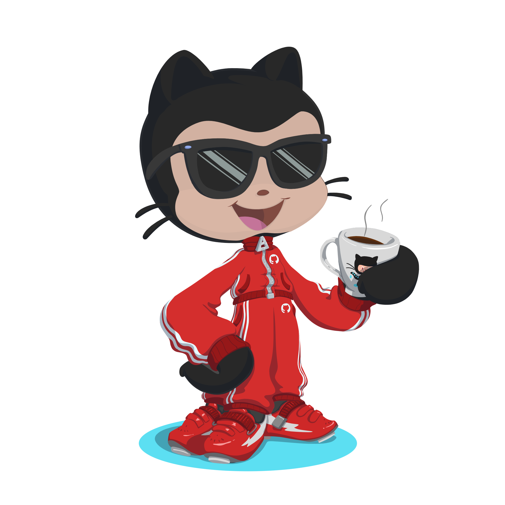

<h1 align="center">Hi There 👋! I'm Shorya Raj</h1>

  

<h2 align="center">🚀 Computer Science Student @ Arizona State University 🎓</h2>

<h3 align="center"> 💬 About Me </h3> 

  

  I am a Computer Science student at <strong>Arizona State University</strong> with a passion for building intelligent systems and scalable applications. My expertise spans <strong>full-stack web development</strong>, where I create seamless user experiences with modern frameworks, <strong>machine learning and AI</strong>, where I develop models for real-world problem solving, and <strong>data science</strong>, where I transform raw data into actionable insights. I also work on <strong>mobile development</strong> and explore <strong>cloud technologies</strong> to deploy robust solutions. Whether it's crafting responsive interfaces, training neural networks, or optimizing databases, I love tackling complex challenges and turning ideas into functional software.

---

  <samp>
    💻 Passionate about Software Development, AI, and Web Technologies 🌐 
    🌱 Constantly Learning and Exploring New Tech 📚 
    🤝 Open to Collaborate on Exciting Projects 💡 
  </samp>

---

<h3 align="center">🛠️ Technical Stack</h3>

  

  

  

  

  

  

  

  
  
  
  
  
  
  
  

  
  
  

  
  
  
  
  
  
  
  

  
  
  
  
  
  
  
  

  
  
  
  
  
  
  

  
  
  
  
  
  
  

  

  

  

